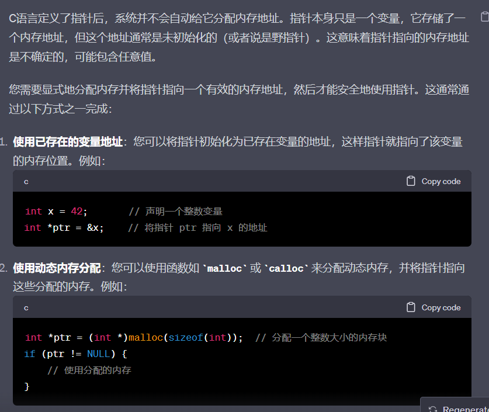

[100道C语言面试题](https://blog.csdn.net/qwe5959798/article/details/104511822)


# 什么是函数重入


# 字符串字面值
字符串字面值是指在C语言中用*双引号括起来的字符串*。它们是在程序编译时创建的，存储在*只读内存中*，因此被视为常量。字符串字面值是不可变的，这意味着一旦创建，就不能直接修改它们的内容。例如：

```c
const char *str = "Hello, World!";
```


# 野指针

```c
int *ptr  = 10;//是错的

/*

因为ptr只是存储内存地址的变量,系统并不会自动给他分配内存地址,也就是说在未初始画ptr的值的时候,ptr的内存地址变量是随机的,这个时候改变*ptr的值就会随机改变一个内存地址的值导致系统崩溃


*/
```

